# WakaTime Stats Action

Generate a customizable SVG card from your coding activity over the last seven
days, using the WakaTime API and GitHub Actions.

This action uses the WakaTime card renderer from the MIT-licensed
[`@stats-organization/github-readme-stats-core`](https://github.com/stats-organization/github-stats-extended/tree/master/packages/core)
package to generate the card. It fetches your statistics directly from
WakaTime using your API key.

<details>
<summary><strong>What is WakaTime?</strong></summary>

[WakaTime](https://wakatime.com/) is a developer productivity platform that
automatically tracks your coding activity across editors, languages, and
projects. This action turns those statistics into a customizable SVG card
that you can display in your GitHub profile or repository README.

</details>

## Features

- Generates a WakaTime statistics card as an SVG file
- Supports compact layouts, themes, custom colors, and language filtering
- Waits for WakaTime to finish calculating recently updated statistics
- Writes the card anywhere in the checked-out repository

## How it differs

The related
[`stats-organization/github-readme-stats-action`](https://github.com/stats-organization/github-readme-stats-action)
identifies a WakaTime user by username. This action instead authenticates with
your WakaTime API key and fetches statistics for the current user. Because the
API key identifies your account, no custom WakaTime profile username is needed,
so the card can be generated using [WakaTime's Free plan](https://wakatime.com/pricing).

## Quick start

### 1. Add your WakaTime API key

Copy your API key from the [WakaTime API key page](https://wakatime.com/api-key),
then add it to the repository that will generate the card:

1. Open **Settings → Secrets and variables → Actions**.
2. Select **New repository secret**.
3. Name the secret `WAKATIME_API_KEY` and paste your API key as its value.

Do not put the API key directly in a workflow file.

### 2. Add a workflow

Create `.github/workflows/wakatime.yml` in the repository where you want to
store the generated card:

```yaml
name: Update WakaTime card

on:
  workflow_dispatch:
  schedule:
    - cron: "0 0 * * *"

permissions:
  contents: write

jobs:
  update-card:
    runs-on: ubuntu-latest

    steps:
      - name: Check out repository
        uses: actions/checkout@v7

      - name: Generate WakaTime card
        uses: twelnina/wakatime-stats-action@v0.1.0
        with:
          wakatime-api-key: ${{ secrets.WAKATIME_API_KEY }}
          output-path: assets/wakatime.svg
          layout: compact
          theme: transparent
          hide-border: true

      - name: Commit updated card
        run: |
          git config user.name "github-actions[bot]"
          git config user.email "41898282+github-actions[bot]@users.noreply.github.com"
          git add assets/wakatime.svg
          git diff --cached --quiet || git commit -m "chore: update WakaTime stats"
          git push
```

The action generates the SVG but does not commit it. The final workflow step
above commits the card only when its contents have changed.

### 3. Embed the card

After the workflow has generated and committed the file, add it to your
README:

```markdown

```

## Inputs

| Input | Required | Default | Description |
| --- | --- | --- | --- |
| `wakatime-api-key` | Yes | — | WakaTime API key used to request the current user's statistics. |
| `output-path` | No | `wakatime-card.svg` | Path where the generated SVG is written. |
| `layout` | No | `normal` | Card layout: `normal` or `compact`. |
| `langs-count` | No | All | Maximum number of languages to display. |
| `card-width` | No | `495` | Card width in pixels. |
| `theme` | No | `default` | Card theme. See [Themes](#themes). |
| `hide-border` | No | `false` | Set to `true` to hide the card border. |
| `line-height` | No | `25` | Distance between language rows in pixels. Only applies to the `normal` layout. |
| `display-format` | No | `time` | Language value format: `time` or `percent`. |
| `hide` | No | — | Comma-separated list of languages to exclude. |
| `hide-title` | No | `false` | Set to `true` to hide the card title. |
| `custom-title` | No | — | Custom title displayed on the card. |
| `locale` | No | `en` | Card language. See [Locales](#locales). |
| `title-color` | No | Theme value | Card title color as a hex value without `#`. |
| `text-color` | No | Theme value | Card text color as a hex value without `#`. |
| `bg-color` | No | Theme value | Card background color as a hex value without `#`. |
| `border-color` | No | Theme value | Card border color as a hex value without `#`. |
| `border-radius` | No | `4.5` | Card border radius in pixels. |
| `disable-animations` | No | `false` | Set to `true` to disable SVG animations. |

All workflow input values are strings. Boolean inputs should be written as
`true` or `false`.

### Layouts

- `normal` displays one language per row with a progress bar.
- `compact` displays languages in two columns with a combined progress bar.

The `line-height` input only affects the `normal` layout. The `compact` layout
uses fixed row spacing and ignores this input.

Both examples below use the same sample statistics:

| `normal` | `compact` |
| :---: | :---: |
|  |  |

### Themes

Some commonly used themes are `default`, `transparent`, `dark`, `radical`,
`tokyonight`, `onedark`, `dracula`, `nord`, `github_dark`, and
`catppuccin_mocha`.

<details>
<summary>Show all available themes</summary>

`default`, `default_repocard`, `transparent`, `shadow_red`, `shadow_green`,
`shadow_blue`, `dark`, `radical`, `merko`, `gruvbox`, `gruvbox_light`,
`tokyonight`, `onedark`, `cobalt`, `synthwave`, `highcontrast`, `dracula`,
`prussian`, `monokai`, `vue`, `vue-dark`, `shades-of-purple`, `nightowl`,
`buefy`, `blue-green`, `algolia`, `great-gatsby`, `darcula`, `bear`,
`solarized-dark`, `solarized-light`, `chartreuse-dark`, `nord`, `gotham`,
`material-palenight`, `graywhite`, `vision-friendly-dark`, `ayu-mirage`,
`midnight-purple`, `calm`, `flag-india`, `omni`, `react`, `jolly`,
`maroongold`, `yeblu`, `blueberry`, `slateorange`, `kacho_ga`, `outrun`,
`ocean_dark`, `city_lights`, `github_dark`, `github_dark_dimmed`,
`discord_old_blurple`, `aura_dark`, `panda`, `noctis_minimus`, `cobalt2`,
`swift`, `aura`, `apprentice`, `moltack`, `codeSTACKr`, `rose_pine`,
`catppuccin_latte`, `catppuccin_mocha`, `date_night`, `one_dark_pro`, `rose`,
`holi`, `neon`, `blue_navy`, `calm_pink`, `ambient_gradient`

</details>

### Locales

Available locale values are:

`ar`, `az`, `be`, `bg`, `bn`, `ca`, `cn`, `cs`, `de`, `el`, `en`, `es`,
`fa`, `fi`, `fil`, `fr`, `he`, `hi`, `hu`, `id`, `it`, `ja`, `kr`, `ml`,
`my`, `nl`, `no`, `np`, `pl`, `pt-br`, `pt-pt`, `ro`, `ru`, `sa`, `se`,
`sk`, `sr`, `sr-latn`, `sw`, `ta`, `th`, `tr`, `uk-ua`, `ur`, `uz`, `vi`,
`zh-tw`

### Custom colors

Specify colors as three-, four-, six-, or eight-digit hex values without a
leading `#`, for example `ff0000` or `1f2328`. The `bg-color` input also
supports gradients in the form `angle,color1,color2`, for example
`90,ffffff,000000`.

## Notes

- Statistics cover the last seven days.
- WakaTime may still be calculating recent activity. The action retries for a
  short period and fails if the data does not become current.
- The generated file is overwritten when it already exists.
- Treat your WakaTime API key as a secret and rotate it if it is exposed.

## License

This project is licensed under the [MIT License](LICENSE).
